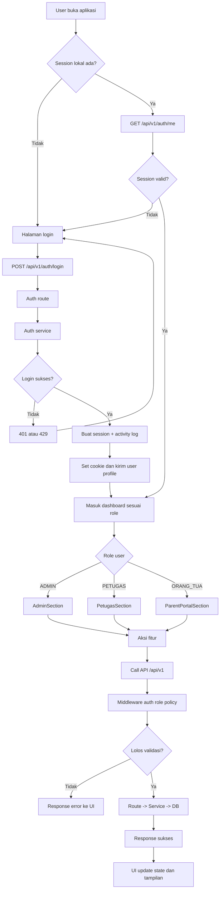
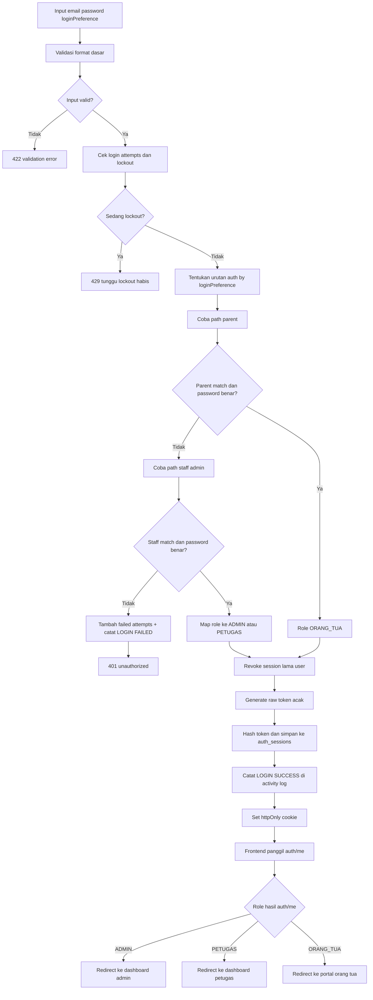
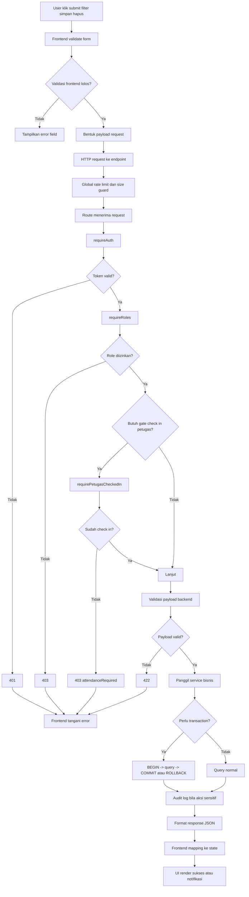
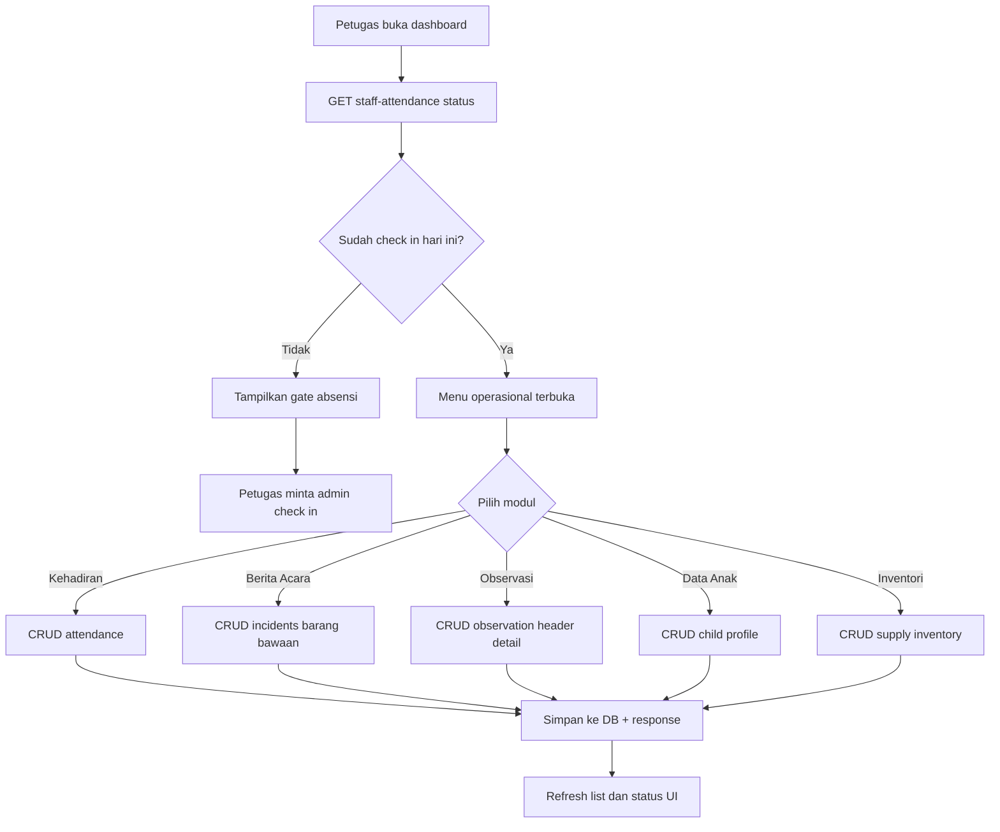
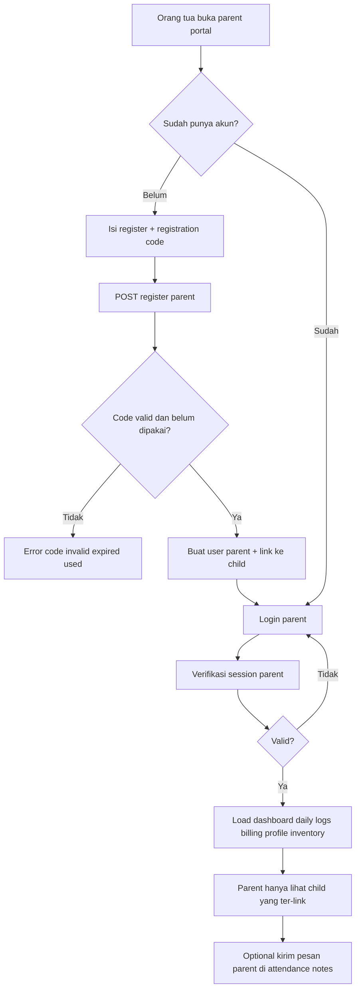
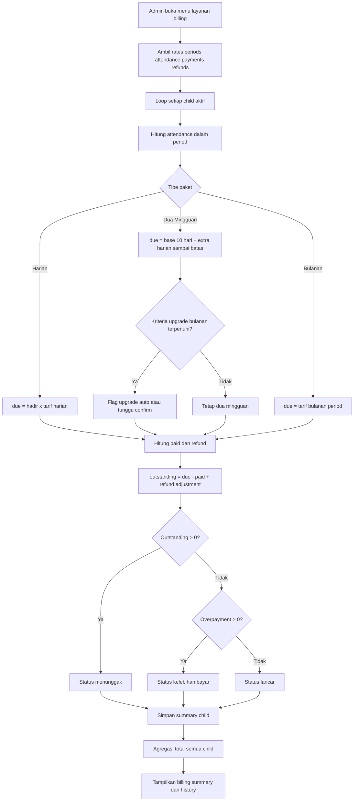

# Belajar Platform TPA Dari Nol (Untuk yang Belum Paham Coding)

Dokumen ini dibuat untuk kamu yang merasa:
- belum paham coding,
- bingung baca file teknis,
- ingin paham **apa, bagaimana, kenapa** secara bertahap.

Kalau dokumen 13 poin terasa berat, **mulai dari dokumen ini dulu**.

---

## Cara Pakai Dokumen Ini
Aturan penting:
1. Jangan baca semua sekaligus.
2. Kerjakan 1 sesi per hari (30-60 menit).
3. Tiap sesi harus menghasilkan catatan 1 halaman.
4. Fokus ke 3 pertanyaan:
   - **Apa** fungsi bagian ini?
   - **Bagaimana** alurnya berjalan?
   - **Kenapa** dibuat seperti itu?

---

## Peta Super Sederhana Sistem (Versi Manusia)
Bayangkan platform ini seperti restoran:
- **Frontend** = ruang kasir/tempat pelanggan lihat menu.
- **Backend** = dapur yang memproses pesanan.
- **Database** = gudang/lemari catatan.

Alur umum:
1. User klik/isi form di frontend.
2. Frontend kirim request ke backend (`/api/v1/...`).
3. Backend cek aturan (login? role? validasi?).
4. Kalau valid, backend baca/tulis ke database.
5. Backend kirim hasil ke frontend.
6. Frontend menampilkan hasil ke user.

---

## Kamus Istilah Wajib (Sangat Dasar)
- `Frontend`: tampilan yang dilihat user.
- `Backend`: logika server.
- `API`: jalur kromunikasi frontend <-> backend.
- `Route`: alamat endpoint API.
- `Service`: tempat logika bisnis utama.
- `Middleware`: “satpam” sebelum masuk route.
- `Session`: tanda user masih login.
- `Role`: hak akses (`ADMIN`, `PETUGAS`, `ORANG_TUA`).
- `CRUD`: create, read, update, delete data.

---

## Flowchart Platform TPA (Menyeluruh dan Sangat Komprehensif)
Tujuan section ini: memberi peta algoritma lengkap dari startup, login, akses role, alur request, sampai billing.

### 1) Master Flow End-to-End Platform


### 2) Flowchart Algoritma Login + Session + Routing Role


### 3) Flowchart Algoritma Request Fitur (Semua Modul)


### 4) Flowchart Algoritma Operasional Petugas


### 5) Flowchart Algoritma Parent Portal


### 6) Flowchart Algoritma Billing Admin (Paling Kompleks)


### Cara Baca Flowchart Ini
1. Mulai dari diagram 1 dulu agar paham gambaran besar.
2. Lanjut diagram 2 untuk paham autentikasi dan session.
3. Lanjut diagram 3 untuk paham pola semua endpoint.
4. Dalami diagram 4 sampai 6 sesuai modul yang sedang dipelajari harian.
5. Saat membaca kode, cocokkan node flowchart dengan file route/service terkait.

---

## Sesi 1 (Hari 1): Pahami Login Dulu
Tujuan: paham satu alur lengkap dari UI sampai DB.

File yang dibaca:
1. `src/App.tsx`
2. `src/features/auth/LoginPage.tsx`
3. `src/services/api.ts` (bagian `authApi`)
4. `server/src/routes/auth-routes.ts`
5. `server/src/services/auth-service.ts`

### Yang Harus Kamu Catat
#### A. Apa
- Login itu untuk apa di sistem ini?

#### B. Bagaimana (langkah urut)
Contoh format:
1. User isi email/password di halaman login.
2. Frontend panggil `authApi.login`.
3. Request masuk ke route `/auth/login`.
4. Backend validasi email/password.
5. Backend buat session.
6. Frontend simpan session dan tampilkan dashboard sesuai role.

#### C. Kenapa
- Kenapa butuh session?
- Kenapa ada role?
- Kenapa route dan service dipisah?

---

## Sesi 2 (Hari 2): Pahami Role dan Hak Akses
File:
1. `server/src/middlewares/auth-middleware.ts`
2. `server/src/app.ts` (bagian mount route)

Fokus:
- Bedakan `requireAuth`, `requireRoles`, `requirePetugasCheckedIn`.
- Jawab: kenapa petugas harus check-in dulu?

Output catatan:
- Tabel kecil:
  - Middleware
  - Fungsinya
  - Kapan dipakai

---

## Sesi 3 (Hari 3): Pahami 1 Fitur Operasional (Kehadiran)
File:
1. `src/features/petugas/kehadiran/KehadiranPage.tsx`
2. `src/services/api.ts` (bagian `attendanceApi`)
3. `server/src/routes/attendance-routes.ts`
4. `server/src/services/attendance-service.ts`

Tugas:
- Cari data input apa saja.
- Cari validasi apa saja.
- Cari data disimpan ke tabel apa.

Output:
- Diagram sederhana:
  - Form -> API -> Route -> Service -> DB -> Response

---

## Sesi 4 (Hari 4): Pahami Data Anak
File:
1. `src/features/petugas/data-anak/DataAnakPage.tsx`
2. `server/src/routes/child-routes.ts`
3. `server/src/services/child-service.ts`

Fokus:
- Siapa boleh lihat data penuh?
- Siapa data-nya dimasking?
- Kenapa dimasking?

---

## Sesi 5 (Hari 5): Pahami Parent Portal
File:
1. `src/features/parent/ParentPortalSection.tsx`
2. `server/src/routes/parent-routes.ts`
3. `server/src/services/parent-portal-service.ts`

Fokus:
- Orang tua bisa lihat data apa?
- Orang tua tidak bisa akses apa?
- Mekanisme link anak via registration code.

---

## Sesi 6 (Hari 6): Pahami Billing (Bagian Paling Kompleks)
File:
1. `src/features/admin/rekap-monitoring/BillingPage.tsx`
2. `server/src/routes/admin-routes.ts` (endpoint billing)
3. `server/src/services/service-billing-service.ts`

Fokus:
- Input billing period/payment/refund.
- Bagaimana status tagihan dibentuk.
- Kenapa ada `period` dan `arrears`.

Catatan:
- Ini bagian sulit. Tidak apa-apa kalau perlu 2-3 hari.

---

## Template Catatan Harian (Wajib Diisi)
Copy template ini tiap sesi:

```md
## Modul: <nama modul>

### Apa
- ...

### Bagaimana (langkah urut)
1. ...
2. ...
3. ...

### Kenapa
- ...

### Risiko yang saya temukan
- ...

### Yang belum saya paham
- ...
```

---

## Cara Baca Kode Tanpa Panik
Saat buka file:
1. Cari `export default function` / `const ... =`.
2. Cari fungsi yang dipanggil saat klik submit (`handleSubmit`, `onSave`, dst).
3. Lacak panggilan API (`...Api...`).
4. Cari route backend yang cocok.
5. Cari service backend yang dipanggil route.

Kalau mentok:
- Jangan lanjut ke file lain.
- Tulis “yang saya belum paham” secara spesifik 1 kalimat.

---

## Target Realistis 14 Hari
Hari 1-3: login, role, kehadiran.  
Hari 4-6: data anak, berita acara, observasi.  
Hari 7-9: parent portal dan registration code.  
Hari 10-12: billing dan backup.  
Hari 13-14: rangkum semua jadi 1 dokumen presentasi.

---

## Kalimat Presentasi Siap Pakai
Pakai pola ini saat ditanya:
1. “Fitur ini tujuannya adalah ...” (**Apa**)
2. “Alurnya dimulai dari ... lalu ... hingga ...” (**Bagaimana**)
3. “Pendekatan ini dipilih karena ... dengan tradeoff ...” (**Kenapa**)

---

## Penutup
Kamu tidak gagal karena belum paham.  
Yang penting sekarang: ubah dari “AI membangun” menjadi “kamu menguasai”.

Mulai dari 1 alur kecil, ulangi tiap hari, dan catat dengan format yang konsisten.
