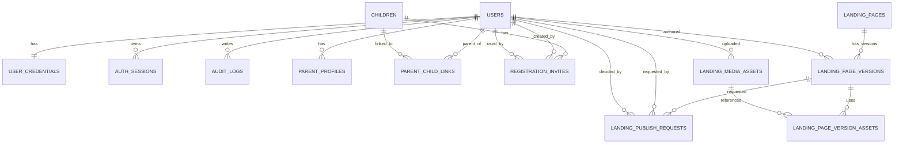

# Rancangan Platform TPA (Draft)

Dokumen ini menyimpan rancangan arsitektur, ERD, migrasi schema, dan endpoint auth/CMS landing page untuk rencana pengembangan platform:

- Landing page publik sebagai domain utama
- Aplikasi manajemen (admin/petugas) di subdomain
- Aplikasi orang tua (parent portal) di subdomain
- Satu database terpusat dengan kontrol akses ketat

Status: `DRAFT` (belum dieksekusi)

---

## 1. Struktur Domain yang Disarankan

### Opsi target final (disarankan)
- `tparumahceria.com` -> landing page publik
- `app.tparumahceria.com` -> platform manajemen admin/petugas
- `parent.tparumahceria.com` -> portal orang tua
- `api.tparumahceria.com` -> backend API terpusat

### Opsi sementara (saat masih `.my.id`)
- `tparumahceria.my.id` -> landing page publik
- `app.tparumahceria.my.id` -> platform manajemen
- `parent.tparumahceria.my.id` -> portal orang tua
- `api.tparumahceria.my.id` -> backend API

Catatan:
- Jika belum punya `.com`, tetap bisa jalan aman dan rapi di `.my.id`.
- Saat migrasi ke `.com`, cukup pindah DNS + SSL + env domain/cookie.

---

## 2. Arsitektur Aplikasi (Monorepo)

```txt
PROJECT TPA/
  apps/
    landing/          # landing page publik
    admin/            # app admin/petugas
    parent/           # app orang tua
    api/              # backend API
  packages/
    ui/
    types/
    utils/
```

Kelebihan:
- Satu repository, standar coding seragam
- Shared component/type lebih terkontrol
- Deploy tetap terpisah per app

---

## 3. ERD Lengkap (Draft)



Prinsip penting:
- `registration code` bukan foreign key utama.
- FK utama tetap `child_id` (ID internal).
- Kode registrasi hanya token undangan sekali pakai.

---

## 4. Schema Migrasi (Urutan File)

1. `001_auth_core.sql`
2. `002_parent_registration.sql`
3. `003_landing_cms.sql`
4. `004_seed_superadmin.sql`
5. `005_backfill_existing_data.sql`

### 4.1. 001_auth_core.sql (inti auth)
- `users`
- `user_credentials`
- `auth_sessions`
- `audit_logs`

### 4.2. 002_parent_registration.sql
- `parent_profiles`
- `parent_child_links`
- `registration_invites`

### 4.3. 003_landing_cms.sql
- `landing_pages`
- `landing_page_versions`
- `landing_publish_requests`
- `landing_media_assets`
- `landing_page_version_assets`

### 4.4. 004_seed_superadmin.sql
- Seed akun superadmin awal (password hash)

### 4.5. 005_backfill_existing_data.sql
- Mapping data lama ke tabel baru (users/roles/link parent-child)

---

## 5. Aturan Keamanan Inti

1. Tidak ada shared password.
2. SuperAdmin pakai akun sendiri (`role=SUPERADMIN`).
3. Admin boleh edit draft landing, publish harus di-approve SuperAdmin.
4. Semua aksi sensitif wajib masuk `audit_logs`.
5. Parent hanya bisa akses data anak yang ter-link di `parent_child_links`.
6. Password disimpan hash kuat (`argon2id` atau bcrypt cost tinggi).
7. Refresh token rotation + revoke.
8. Rate limit login/register/kode registrasi.
9. Kode registrasi:
   - random kuat
   - one-time use
   - ada expiry
   - disimpan dalam bentuk hash (`code_hash`)

---

## 6. Desain Endpoint Auth (Siap Implementasi)

### 6.1 Register Parent
`POST /v1/auth/register/parent`

Request:
```json
{
  "email": "orangtua@gmail.com",
  "password": "StrongPass#2026",
  "fullName": "Nama Orang Tua",
  "registrationCode": "TPA-ABCD-1234"
}
```

Response `201`:
```json
{
  "success": true,
  "data": {
    "user": {
      "id": "usr_xxx",
      "role": "PARENT",
      "email": "orangtua@gmail.com"
    },
    "redirectUrl": "https://parent.tparumahceria.com"
  }
}
```

### 6.2 Login
`POST /v1/auth/login`

Request:
```json
{
  "email": "admin@tpa.com",
  "password": "******",
  "app": "landing"
}
```

Response `200`:
```json
{
  "success": true,
  "data": {
    "accessToken": "jwt_access_token",
    "expiresIn": 900,
    "user": {
      "id": "usr_xxx",
      "role": "ADMIN"
    },
    "redirectUrl": "https://app.tparumahceria.com"
  }
}
```

### 6.3 Refresh Token
`POST /v1/auth/refresh`

Response `200`:
```json
{
  "success": true,
  "data": {
    "accessToken": "new_access_token",
    "expiresIn": 900
  }
}
```

### 6.4 Logout
`POST /v1/auth/logout`

Response `200`:
```json
{
  "success": true,
  "data": {
    "loggedOut": true
  }
}
```

### 6.5 Current User
`GET /v1/auth/me`

Response `200`:
```json
{
  "success": true,
  "data": {
    "user": {
      "id": "usr_xxx",
      "role": "PARENT",
      "email": "..."
    },
    "childIds": ["ch_1", "ch_2"]
  }
}
```

---

## 7. Desain Endpoint Landing CMS (Admin + SuperAdmin)

### Public
- `GET /v1/public/landing/pages/:slug` -> ambil versi `PUBLISHED`

### Admin (draft editor)
- `PUT /v1/admin/landing/pages/:slug/draft`
- `POST /v1/admin/landing/pages/:slug/publish-request`
- `POST /v1/admin/landing/assets/upload`

### SuperAdmin (approval)
- `POST /v1/superadmin/landing/publish-requests/:id/approve`
- `POST /v1/superadmin/landing/publish-requests/:id/reject`

---

## 8. Alur Landing Editor yang Aman

1. Admin login.
2. Admin edit konten landing -> simpan `DRAFT`.
3. Admin kirim `publish request`.
4. SuperAdmin login dan melakukan `approve/reject`.
5. Jika approve, sistem ubah versi jadi `PUBLISHED`.
6. Semua event dicatat ke audit log.

Catatan:
- Jika butuh proteksi ekstra, saat approve minta `re-auth` (konfirmasi password/OTP).

---

## 9. Checklist Go-Live Keamanan

1. HTTPS aktif semua domain/subdomain.
2. Cookie `HttpOnly + Secure + SameSite`.
3. CORS allowlist ketat hanya origin resmi.
4. Header keamanan: CSP, HSTS, X-Frame-Options, X-Content-Type-Options.
5. Rate limit endpoint sensitif.
6. Backup harian + uji restore berkala.
7. Monitoring log dan alert untuk login gagal beruntun.

---

## 10. Catatan Eksekusi Berikutnya

Dokumen ini hanya rancangan. Eksekusi bertahap disarankan:

1. Implement landing page publik dulu.
2. Implement auth core + register parent by code.
3. Implement parent portal read-only by relation.
4. Implement landing CMS + workflow approval superadmin.
5. Hardening keamanan + observability.

