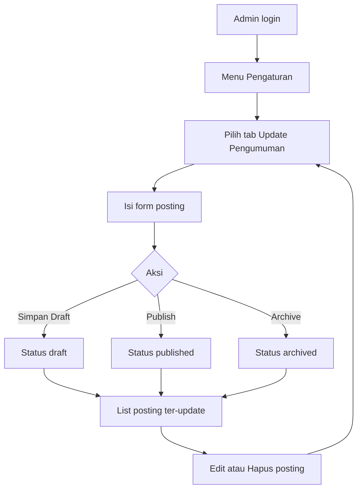
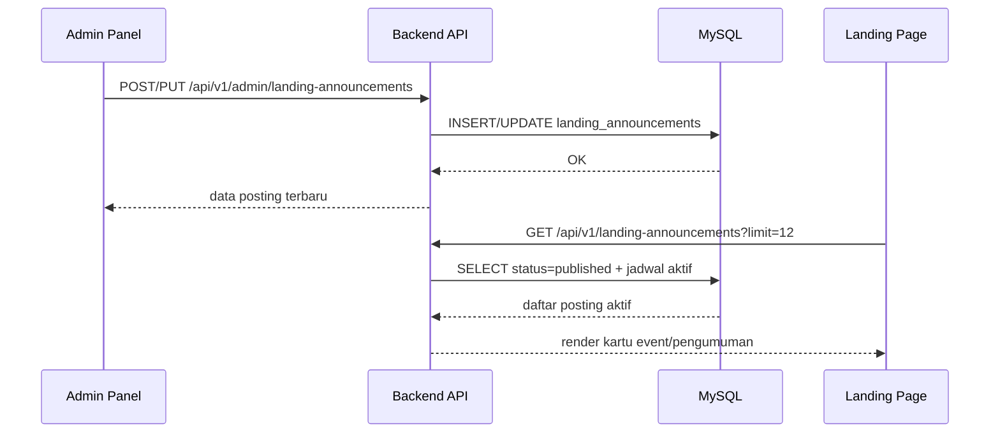

# Rancangan Fitur Admin: Update Pengumuman

## 1. Tujuan Fitur
`Update Pengumuman` adalah panel CMS mini pada role `ADMIN` untuk mengelola konten landing page:
- Event
- Dokumentasi kegiatan
- Promosi
- Ucapan hari tertentu

Konsep interaksi dibuat seperti blogspot: admin menulis posting, memberi kategori, mengatur jadwal tayang, lalu publish.

## 2. Konsep UI (Blogspot Style)
Panel terdiri dari dua area:
- Form editor posting (create/edit):
  judul, slug, kategori, ringkasan, isi, cover image, CTA, jadwal tayang, status, pin.
- Daftar posting:
  table list dengan search + filter status/kategori, aksi edit/hapus.

Status konten:
- `draft`: belum tampil di landing.
- `published`: tampil di landing jika masuk rentang jadwal.
- `archived`: tidak tampil di landing.

## 3. User Flow

## 4. System Flow

## 5. Rule Bisnis Utama
- Hanya role `ADMIN` yang bisa CRUD pengumuman.
- Slug otomatis dibentuk jika kosong dan dijaga unik.
- Landing hanya menampilkan posting:
  - `status = published`
  - `publish_start_date <= hari ini` (atau kosong)
  - `publish_end_date >= hari ini` (atau kosong)
- Konten `isPinned = true` ditaruh paling atas.

## 6. Data Model
Tabel: `landing_announcements`
- `id`, `slug`, `title`
- `category` (`event|dokumentasi|promosi|ucapan`)
- `excerpt`, `content`
- `cover_image_data_url`, `cover_image_name`
- `cta_label`, `cta_url`
- `publish_start_date`, `publish_end_date`
- `status` (`draft|published|archived`)
- `is_pinned`, `published_at`
- `author_name`, `author_email`
- `created_at`, `updated_at`

## 7. Endpoint
- Admin:
  - `GET /api/v1/admin/landing-announcements`
  - `POST /api/v1/admin/landing-announcements`
  - `PUT /api/v1/admin/landing-announcements/:id`
  - `DELETE /api/v1/admin/landing-announcements/:id`
- Public landing:
  - `GET /api/v1/landing-announcements?limit=12&category=event`

## 8. Output ke Landing Page
Blok `Kegiatan > Event` pada landing sekarang membaca data dari API public di atas.
Jika API kosong/gagal, sistem fallback ke data statis bawaan agar landing tetap punya konten.
